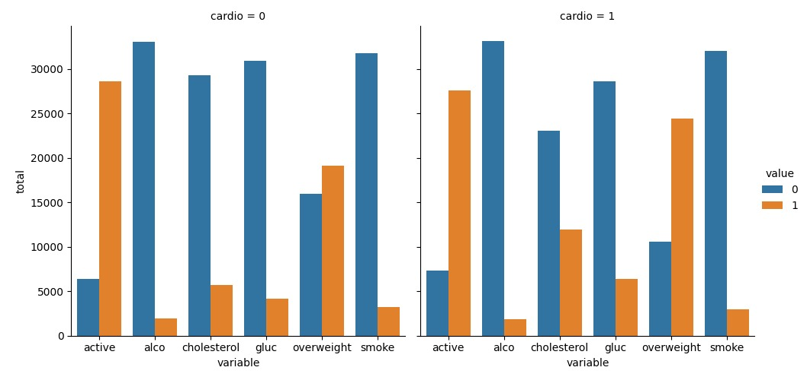
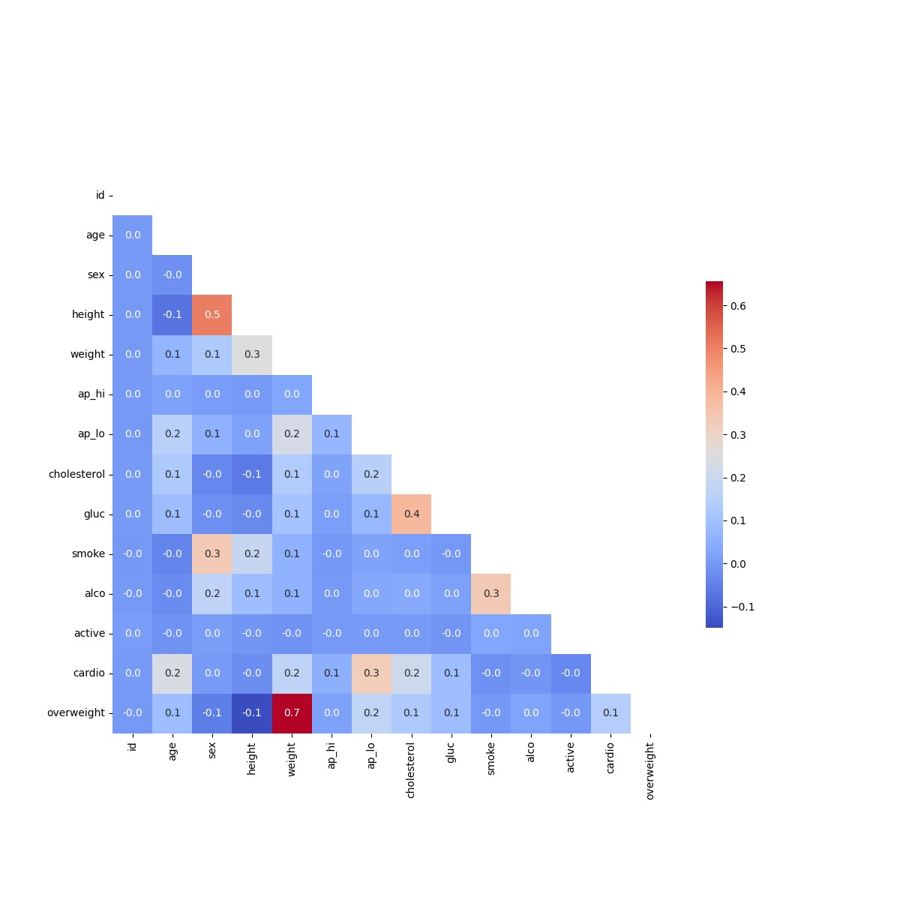

# Data-Analysis-project-FCC---Medical-Data-Visualizer

### Description
This project involves visualizing and analyzing medical examination data. The goal is to explore the relationships between:
- Cardiac disease
- Body measurements
- Blood markers
- Lifestyle choices

### Key Features
- Data cleaning and preprocessing.
- Adding a new feature: BMI-based "overweight" classification.
- Generating visualizations using **Matplotlib** and **Seaborn**:
  - **Categorical Plot**: Visualizing counts of good/bad outcomes.
  - **Heatmap**: Showing correlations between medical features.

### Files
- `medical_data_visualizer.py`: Python script for data analysis and visualization.
- `test_module.py`: Test cases for functionality.
- `catplot.png`: Categorical plot image.
- `heatmap.png`: Heatmap image.

### Example Outputs
#### Categorical Plot

#### Heatmap

---

## License
This repository is licensed under the MIT License. Feel free to use and modify the code as needed.

---

## Acknowledgements
Special thanks to my learning platform and mentors for guiding me through these projects.
